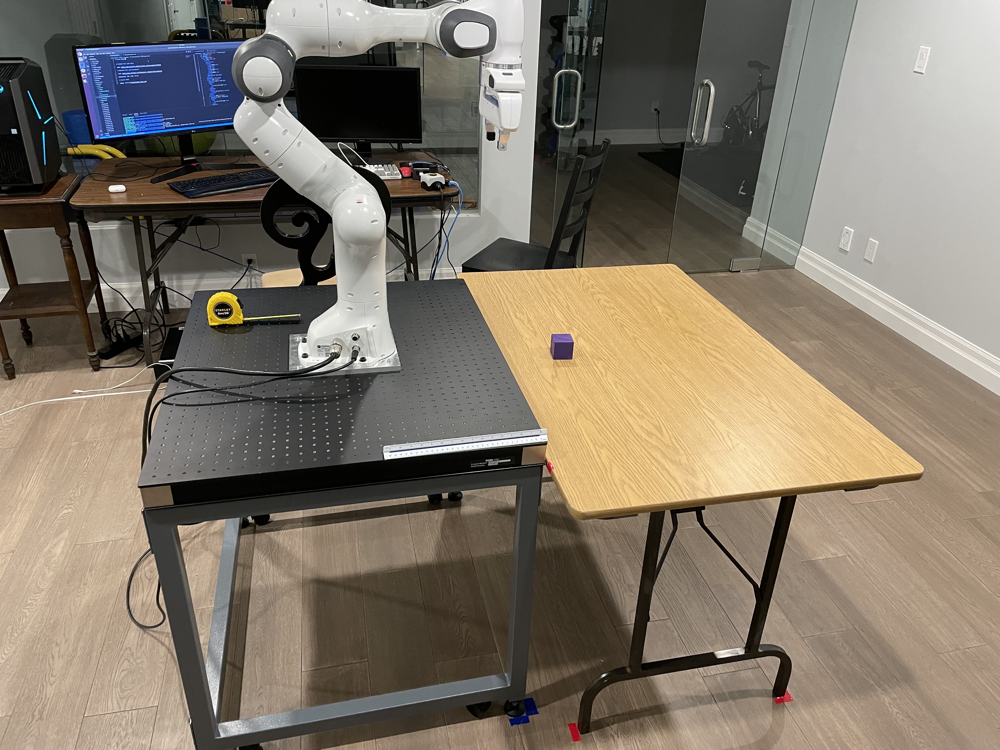
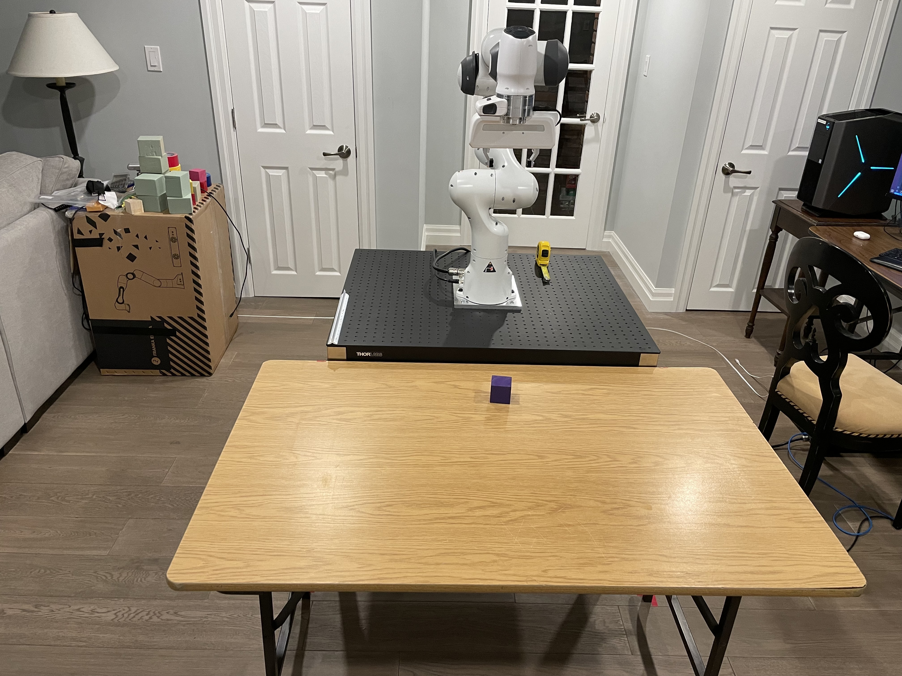
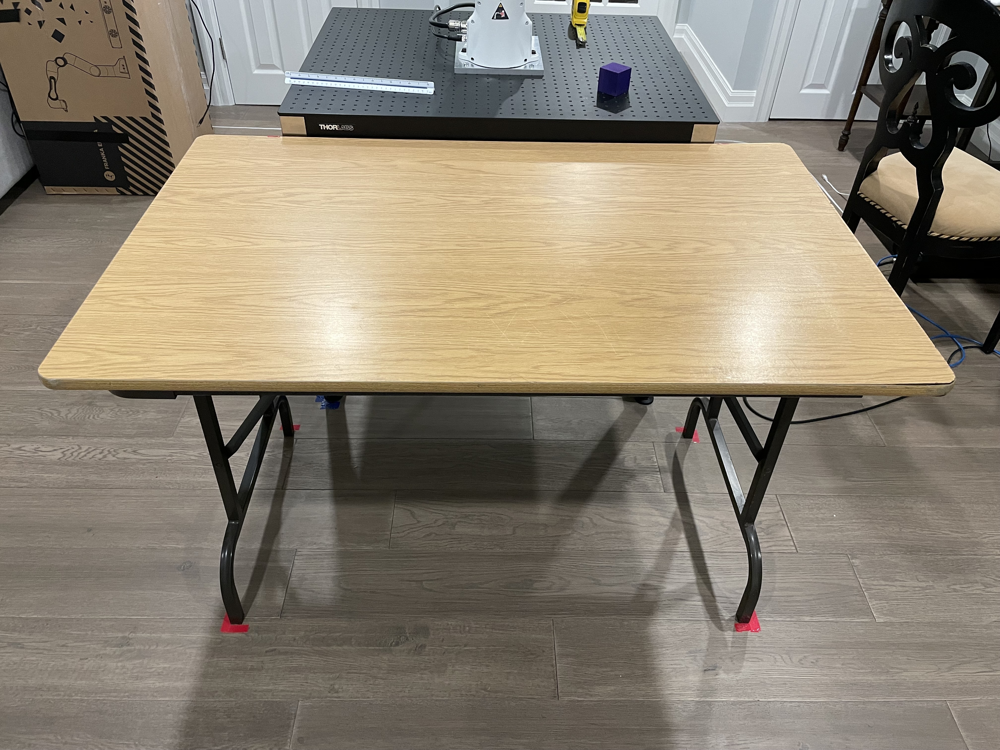

# Setup

 
 

# PFM5203 Thor Labs Table

link: https://www.thorlabs.com/thorproduct.cfm?partnumber=PFM52503
Mass: 56.000514 kg
Frame Height: 727 mm (from bottom of casters to below spacers)
Top dimensions: 750 x 900 mm
Spacer width: 5 mm

# PBG52510 Thor Labs Breadboard

link: https://www.thorlabs.com/thorproduct.cfm?partnumber=PBG52510
Dimensions: 750 x 900 x 55 mm
Mass: 24.2808 kg
Hole center-center distance: 25 mm
Distance from edge to center of nearest holes: 25 mm on all sides

# Custom Metal bracket

245 x 203 x 13 mm
placed perfectly in the center of the breadboard
panda is situated with the front of its base directly ontop of the bracket

# Wooden Table

 
Dimensions: 760 x 1215 x 740 mm

# wood blocks:

Dimensions: 50 x 50 x 50 mm
Mass: 44 g